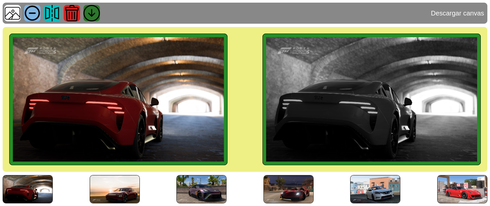
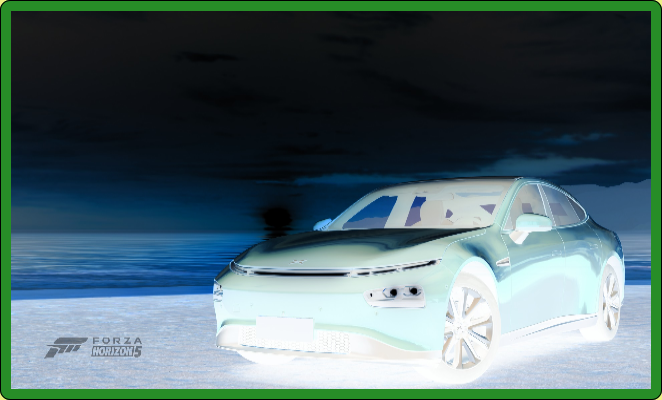
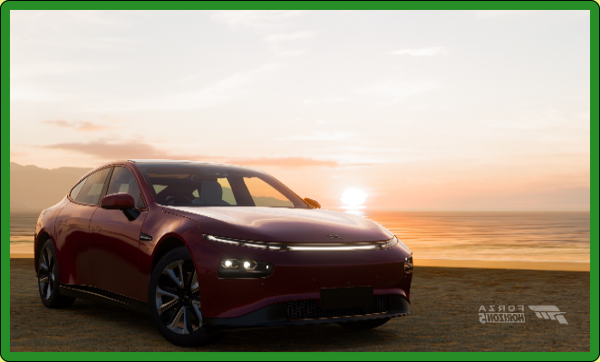

# CanvasEditor
Un editor de imágenes básico utilizando solo JavaScript y Canvas Html

[https://gabriser.github.io/CanvasEditor/](https://gabriser.github.io/CanvasEditor/)

## Descripción

Página web básica que permite aplicar filtros a imágenes utilizando Canvas Html y clases JavaScript ES5.

### Funcionalidades

Primero debe elegir una imagen de ejemplo que se encuentra abajo para poder aplicar una de las siguientes opciones:

#### Filtro blanco y negro

Aplica un filtro de colores en blanco y negro al canvas.

#### Filtro negativo

Aplica un filtro de colores negativo al canvas.

#### Invertir horizontalmente

Permite invertir horizontalmente el canvas.

#### Borrar canvas

Permite borrar el canvas seleccionado.

#### Descargar canvas

Permite descargar el canvas con las opciones aplicadas a imagen PNG utilizando base64.

## Agradecimentos

- **Imágenes de coches de ejemplo** : Creadas en Forza Horizon 5 (Copyright [Turn 10 Studios](https://www.turn10studios.com/), [PlayGround Games](https://playground-games.com/), Microsoft).
- **Iconos** : [Flaticon](https://www.flaticon.com/).
